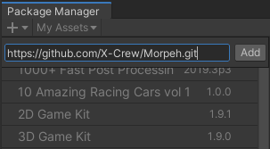
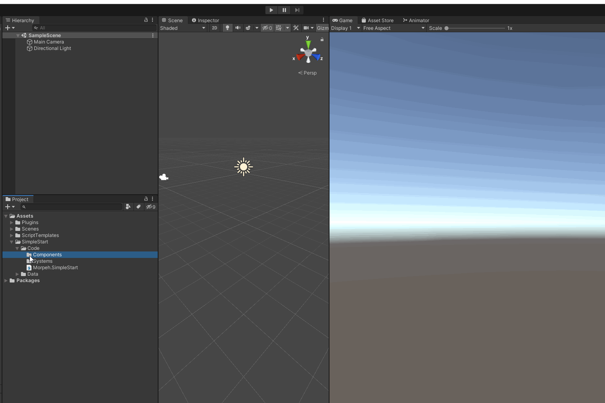
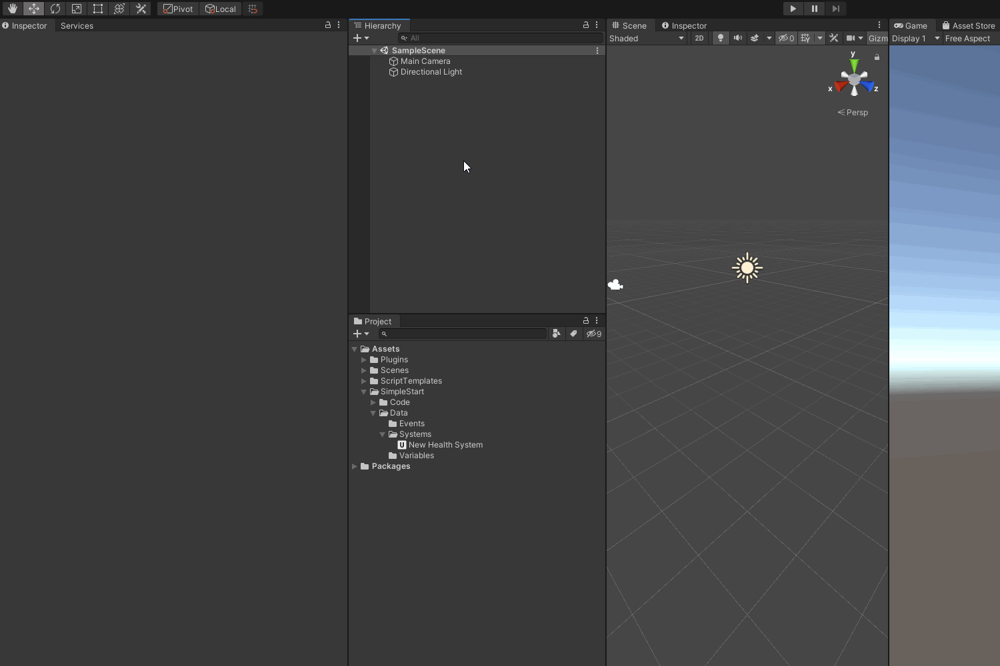
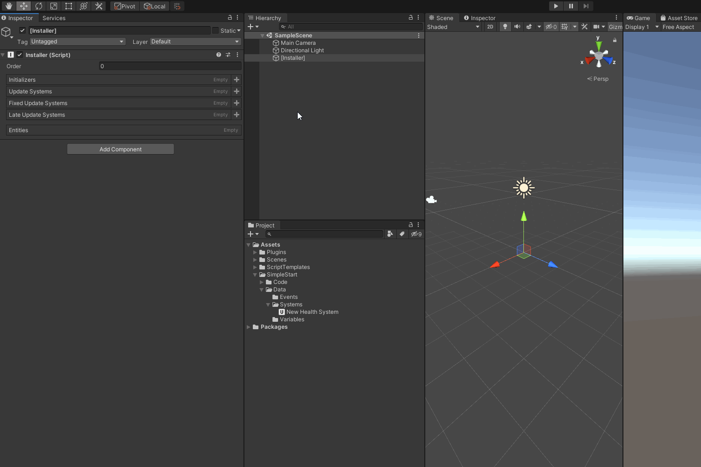
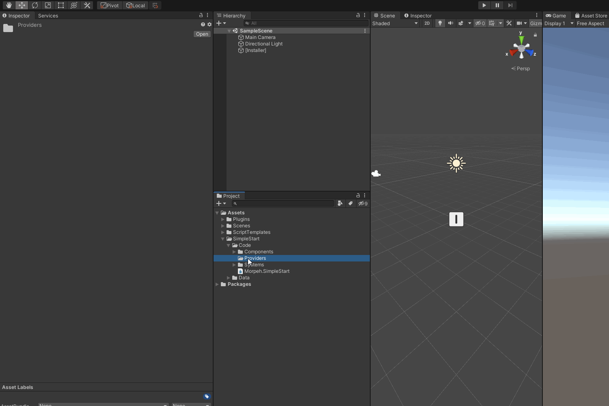
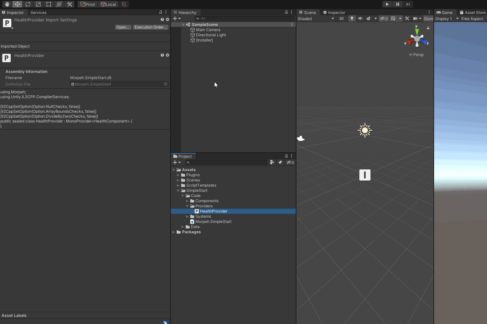

<p align="center">
    
</p>

# Morpeh [](LICENSE.md) [](https://unity.com/) [](package.json)
🎲 **ECS Framework for Unity Game Engine and .Net Platform**  

* Simple Syntax.  
* Plug & Play Installation.  
* No code generation.  
* Structure-Based and Cache-Friendly.  

## 📖 Table of Contents

* [Migration](#-migration-to-new-version)
* [How To Install](#-how-to-install)
  * [Unity Engine](#unity-engine)
  * [.Net Platform](#net-platform)
* [Introduction](#-introduction)
  * [Base concept of ECS pattern](#-base-concept-of-ecs-pattern)
  * [Getting Started](#-getting-started)
  * [Advanced](#-advanced)
    * [Filter Extensions](#-filter-extensions)
    * [Aspects](#-aspects)
    * [Component Disposing](#-component-disposing)
    * [Unity Jobs And Burst](#-unity-jobs-and-burst)
* [Examples](#-examples)
* [Games](#-games)
* [License](#-license)
* [Contacts](#-contacts)

## ✈️ Migration To New Version 

English version: [Migration Guide](MIGRATION.md)  
Russian version: [Гайд по миграции](MIGRATION_RU.md)

## 📖 How To Install 

### Unity Engine 

Minimal Unity Version is 2020.3.*  
Require [Git](https://git-scm.com/) + [Git LFS](https://git-lfs.github.com/) for installing package.  
Currently require [Odin Inspector](https://assetstore.unity.com/packages/tools/utilities/odin-inspector-and-serializer-89041) for drawing in inspector.

<details>
    <summary>Open Unity Package Manager and add Morpeh URL.  </summary>

  

</details>

&nbsp;&nbsp;&nbsp;&nbsp;⭐ Master: https://github.com/scellecs/morpeh.git  
&nbsp;&nbsp;&nbsp;&nbsp;🚧 Dev:  https://github.com/scellecs/morpeh.git#develop  
&nbsp;&nbsp;&nbsp;&nbsp;🏷️ Tag:  https://github.com/scellecs/morpeh.git#2023.1.0  

### .Net Platform

NuGet package URL: https://www.nuget.org/packages/Scellecs.Morpeh

## 📖 Introduction
### 📘 Base concept of ECS pattern

#### 🔖 Entity
Container of components.  
Has a set of methods for add, get, set, remove components.  
It is reference type. Each entity is unique and not pooled. Only entity IDs are reused.  

```c#
var entity = this.World.CreateEntity();

ref var addedHealthComponent  = ref entity.AddComponent<HealthComponent>();
ref var gottenHealthComponent = ref entity.GetComponent<HealthComponent>();

//if you remove last component on entity it will be destroyd on next world.Commit()
bool removed = entity.RemoveComponent<HealthComponent>();
entity.SetComponent(new HealthComponent {healthPoints = 100});

bool hasHealthComponent = entity.Has<HealthComponent>();

var newEntity = this.World.CreateEntity();
//after migration entity has no components, so it will be destroyd on next world.Commit()
entity.MigrateTo(newEntity);
```


#### 🔖 Component
Components are types which include only data.  
In Morpeh components are value types for performance purposes.
```c#
public struct HealthComponent : IComponent {
    public int healthPoints;
}
```

#### 🔖 System

Types that process entities with a specific set of components.  
Entities are selected using a filter.

All systems are represented by interfaces, but for convenience, there are ScriptableObject classes that make it easier to work with the inspector and `Installer`.  
Such classes are the default tool, but you can write pure classes that implement the interface, but then you need to use the `SystemsGroup` API instead of the `Installer`.

```c#
public class HealthSystem : ISystem {
    public World World { get; set; }

    private Filter filter;

    public void OnAwake() {
        this.filter = this.World.Filter.With<HealthComponent>();
    }

    public void OnUpdate(float deltaTime) {
        foreach (var entity in this.filter) {
            ref var healthComponent = ref entity.GetComponent<HealthComponent>();
            healthComponent.healthPoints += 1;
        }
    }

    public void Dispose() {
    }
}
```

All systems types:  
* `IInitializer` & `Initializer` - have only OnAwake and Dispose methods, convenient for executing startup logic
* `ISystem` & `UpdateSystem`
* `IFixedSystem` & `FixedUpdateSystem`
* `ILateSystem` & `LateUpdateSystem`
* `ICleanupSystem` & `CleanupSystem`

#### 🔖 SystemsGroup

The type that contains the systems.  
There is an `Installer` wrapper to work in the inspector, but if you want to control everything from code, you can use the systems group directly.  

```c#
var newWorld = World.Create();

var newSystem = new HealthSystem();
var newInitializer = new HealthInitializer();

var systemsGroup = newWorld.CreateSystemsGroup();
systemsGroup.AddSystem(newSystem);
systemsGroup.AddInitializer(newInitializer);

//it is bad practice to turn systems off and on, but sometimes it is very necessary for debugging
systemsGroup.DisableSystem(newSystem);
systemsGroup.EnableSystem(newSystem);

systemsGroup.RemoveSystem(newSystem);
systemsGroup.RemoveInitializer(newInitializer);

newWorld.AddSystemsGroup(order: 0, systemsGroup);
newWorld.RemoveSystemsGroup(systemsGroup);
```

#### 🔖 World
A type that contains entities, components stashes, systems and root filter.
```c#
var newWorld = World.Create();
//a variable that specifies whether the world should be updated automatically by the game engine.
//if set to false, then you can update the world manually.
//and can also be used for game pauses by changing the value of this variable.
newWorld.UpdateByUnity = true;

var newEntity = newWorld.CreateEntity();
newWorld.RemoveEntity(newEntity);

var systemsGroup = newWorld.CreateSystemsGroup();
systemsGroup.AddSystem(new HealthSystem());

newWorld.AddSystemsGroup(order: 0, systemsGroup);
newWorld.RemoveSystemsGroup(systemsGroup);

var filter = newWorld.Filter.With<HealthComponent>();

var healthCache = newWorld.GetStash<HealthComponent>();
var reflectionHealthCache = newWorld.GetReflectionStash(typeof(HealthComponent));

//manually world updates
newWorld.Update(Time.deltaTime);
newWorld.FixedUpdate(Time.fixedDeltaTime);
newWorld.LateUpdate(Time.deltaTime);
newWorld.CleanupUpdate(Time.deltaTime);

//apply all entity changes, filters will be updated.
//automatically invoked between systems
newWorld.Commit();
```

#### 🔖 Filter
A type that contains entities constrained by conditions With and/or Without.  
You can chain them in any order and quantity.
```c#
var filter = this.World.Filter.With<HealthComponent>()
                              .With<BooComponent>()
                              .Without<DummyComponent>();

var firstEntityOrException = filter.First();
var firstEntityOrNull = filter.FirstOrDefault();

bool filterIsEmpty = filter.IsEmpty();
int filterLengthCalculatedOnCall = filter.GetLengthSlow();

```

#### 🔖 Stash
A type that contains components.  
You can get components and do other operations directly from the stash, because entity methods look up the stash each time on call.  
However, such code is harder to read.
```c#
var healthStash = this.World.GetStash<HealthComponent>();
var entity = this.World.CreateEntity();

ref var addedHealthComponent  = ref healthStash.Add(entity);
ref var gottenHealthComponent = ref healthStash.Get(entity);

bool removed = healthStash.Remove(entity);

healthStash.Set(entity, new HealthComponent {healthPoints = 100});

bool hasHealthComponent = healthStash.Has(entity);

var newEntity = this.World.CreateEntity();
//transfers a component from one entity to another
healthStash.Migrate(from: entity, to: newEntity);

//not a generic variation of stash, so we can only do a limited set of operations
var reflectionHealthCache = newWorld.GetReflectionStash(typeof(HealthComponent));

//set default(HealthComponent) to entity
reflectionHealthCache.Set(entity);

bool removed = reflectionHealthCache.Remove(entity);

bool hasHealthComponent = reflectionHealthCache.Has(entity);
```

---

### 📘 Getting Started
> 💡 **IMPORTANT**  
> For a better user experience, we strongly recommend having Odin Inspector in the project.  
> All GIFs are hidden under spoilers.

<details>
    <summary>After installation import ScriptTemplates and Restart Unity.  </summary>


</details>

Let's create our first component and open it.
<details>
    <summary>Right click in project window and select <code>Create/ECS/Component</code>.  </summary>


</details>


After it, you will see something like this.
```c#  
using Scellecs.Morpeh;
using UnityEngine;
using Unity.IL2CPP.CompilerServices;

[Il2CppSetOption(Option.NullChecks, false)]
[Il2CppSetOption(Option.ArrayBoundsChecks, false)]
[Il2CppSetOption(Option.DivideByZeroChecks, false)]
[System.Serializable]
public struct HealthComponent : IComponent {
}
```
> 💡 Don't care about attributes.  
> Il2CppSetOption attribute can give you better performance.

Add health points field to the component.

```c#  
public struct HealthComponent : IComponent {
    public int healthPoints;
}
```

It is okay.

Now let's create first system.
<details>
    <summary>Right click in project window and select <code>Create/ECS/System</code>.  </summary>


</details>

> 💡 Icon U means UpdateSystem. Also you can create FixedUpdateSystem and LateUpdateSystem, CleanupSystem.  
> They are similar as MonoBehaviour's Update, FixedUpdate, LateUpdate. CleanupSystem called the most recent in LateUpdate.

System looks like this.
```c#  
using Scellecs.Morpeh.Systems;
using UnityEngine;
using Unity.IL2CPP.CompilerServices;

[Il2CppSetOption(Option.NullChecks, false)]
[Il2CppSetOption(Option.ArrayBoundsChecks, false)]
[Il2CppSetOption(Option.DivideByZeroChecks, false)]
[CreateAssetMenu(menuName = "ECS/Systems/" + nameof(HealthSystem))]
public sealed class HealthSystem : UpdateSystem {
    public override void OnAwake() {
    }

    public override void OnUpdate(float deltaTime) {
    }
}
```

We have to add a filter to find all the entities with `HealthComponent`.
```c#  
public sealed class HealthSystem : UpdateSystem {
    private Filter filter;
    
    public override void OnAwake() {
        this.filter = this.World.Filter.With<HealthComponent>();
    }

    public override void OnUpdate(float deltaTime) {
    }
}
```
> 💡 You can chain filters by two operators `With<>` and `Without<>`.  
> For example `this.World.Filter.With<FooComponent>().With<BarComponent>().Without<BeeComponent>();`

The filters themselves are very lightweight and are free to create.  
They do not store entities directly, so if you like, you can declare them directly in hot methods like `OnUpdate()`.  
For example:

```c#  
public sealed class HealthSystem : UpdateSystem {
    
    public override void OnAwake() {
    }

    public override void OnUpdate(float deltaTime) {
        var filter = this.World.Filter.With<HealthComponent>();
        
        //Or just iterate without variable
        foreach (var entity in this.World.Filter.With<HealthComponent>()) {
        }
    }
}
```

But we will focus on the option with caching to a variable, because we believe that the filters declared in the header of system increase the readability of the code.

Now we can iterate all needed entities.
```c#  
public sealed class HealthSystem : UpdateSystem {
    private Filter filter;
    
    public override void OnAwake() {
        this.filter = this.World.Filter.With<HealthComponent>();
    }

    public override void OnUpdate(float deltaTime) {
        foreach (var entity in this.filter) {
            ref var healthComponent = ref entity.GetComponent<HealthComponent>();
            Debug.Log(healthComponent.healthPoints);
        }
    }
}
```
> 💡 Don't forget about `ref` operator.  
> Components are struct and if you want to change them directly, then you must use reference operator.

For high performance, you can use stash directly.  
No need to do GetComponent from entity every time, which trying to find suitable stash.  
However, we use such code only in very hot areas, because it is quite difficult to read it.

```c#  
public sealed class HealthSystem : UpdateSystem {
    private Filter filter;
    private Stash<HealthComponent> healthStash;
    
    public override void OnAwake() {
        this.filter = this.World.Filter.With<HealthComponent>();
        this.healthStash = this.World.GetStash<HealthComponent>();
    }

    public override void OnUpdate(float deltaTime) {
        foreach (var entity in this.filter) {
            ref var healthComponent = ref healthStash.Get(entity);
            Debug.Log(healthComponent.healthPoints);
        }
    }
}
```
We will focus on a simplified version, because even in this version entity.GetComponent is very fast.

Let's create ScriptableObject for HealthSystem.  
This will allow the system to have its inspector and we can refer to it in the scene.
<details>
    <summary>Right click in project window and select <code>Create/ECS/Systems/HealthSystem</code>.  </summary>


</details>

Next step: create `Installer` on the scene.  
This will help us choose which systems should work and in which order.

<details>
    <summary>Right click in hierarchy window and select <code>ECS/Installer</code>.  </summary>


</details>

<details>
    <summary>Add system to the installer and run project.  </summary>


</details>

Nothing happened because we did not create our entities.  
I will show the creation of entities directly related to GameObject, because to create them from the code it is enough to write `world.CreateEntity()`.  
To do this, we need a provider that associates GameObject with an entity.

Create a new provider.

<details>
    <summary>Right click in project window and select <code>Create/ECS/Provider</code>.  </summary>


</details>

```c#  
using Scellecs.Morpeh.Providers;
using Unity.IL2CPP.CompilerServices;

[Il2CppSetOption(Option.NullChecks, false)]
[Il2CppSetOption(Option.ArrayBoundsChecks, false)]
[Il2CppSetOption(Option.DivideByZeroChecks, false)]
public sealed class HealthProvider : MonoProvider<{YOUR_COMPONENT}> {
}
```

We need to specify a component for the provider.
```c#  
public sealed class HealthProvider : MonoProvider<HealthComponent> {
}
```

<details>
    <summary>Create new GameObject and add <code>HealthProvider</code>.  </summary>


</details>

Now press the play button, and you will see Debug.Log with healthPoints.  
Nice!

### 📖 Advanced

#### 🧩 Filter Extensions

Filter extensions required for easy reuse of filter queries.  
Let's look at an example:  

We need to implement the IFilterExtension interface and the type must be a struct.  

```c#  
public struct SomeExtension : IFilterExtension {
    public Filter Extend(Filter rootFilter) => rootFilter.With<Translation>().With<Rotation>();
}
```

The next step is to call the Extend method in any order when requesting a filter.  
The Extend method continues query.

```c#  
private Filter filter;

public void OnAwake() {
    this.filter = this.World.Filter.With<TestA>()
                                   .Extend<SomeExtension>()
                                   .With<TestC>();
}
```

#### 🔍 Aspects
An aspect is an object-like wrapper that you can use to group together a subset of an entity's components into a single C# struct. Aspects are useful for organizing component code and simplifying queries in your systems.  

For example, the Transform groups together the individual position, rotation, and scale of components and enables you to access these components from a query that includes the Transform. You can also define your own aspects with the IAspect interface.  

Our components:
```c#  
    public struct Translation : IComponent {
        public float x;
        public float y;
        public float z;
    }
    
    public struct Rotation : IComponent {
        public float x;
        public float y;
        public float z;
        public float w;
    }

    public struct Scale : IComponent {
        public float x;
        public float y;
        public float z;
    }
```

Let's group them in aspect.  
Simple entity version:

```c#  
public struct Transform : IAspect {
    //Set on each call of AspectFactory.Get(Entity entity)
    public Entity Entity { get; set;}
    
    public ref Translation Translation => ref this.Entity.GetComponent<Translation>();
    public ref Rotation Rotation => ref this.Entity.GetComponent<Rotation>();
    public ref Scale Scale => ref this.Entity.GetComponent<Scale>();

    //Called once on world.GetStash<T>
    public void OnGetAspect(World world) {
    }
}
```

In an aspect, you can write any combination of properties and methods to work with components on an entity.  
Let's write a variation with stashes to make it work faster.

```c#  
public struct Transform : IAspect {
    public Entity Entity { get; set;}
    
    public ref Translation Translation => ref this.translation.Get(this.Entity);
    public ref Rotation Rotation => ref this.rotation.Get(this.Entity);
    public ref Scale Scale => ref this.scale.Get(this.Entity);
    
    private Stash<Translation> translation;
    private Stash<Rotation> rotation;
    private Stash<Scale> scale;

    public void OnGetAspect(World world) {
        this.translation = world.GetStash<Translation>();
        this.rotation = world.GetStash<Rotation>();
        this.scale = world.GetStash<Scale>();
    }
}
```
Let's add an IFilterExtension implementation to always have a query.

```c#  
public struct Transform : IAspect, IFilterExtension {
    public Entity Entity { get; set;}
    
    public ref Translation Translation => ref this.translation.Get(this.Entity);
    public ref Rotation Rotation => ref this.rotation.Get(this.Entity);
    public ref Scale Scale => ref this.scale.Get(this.Entity);
    
    private Stash<Translation> translation;
    private Stash<Rotation> rotation;
    private Stash<Scale> scale;

    public void OnGetAspect(World world) {
        this.translation = world.GetStash<Translation>();
        this.rotation = world.GetStash<Rotation>();
        this.scale = world.GetStash<Scale>();
    }
    public Filter Extend(Filter rootFilter) => rootFilter.With<Translation>().With<Rotation>().With<Scale>();
}
```

Now we write a system that uses our aspect.

```c#  
public class TransformAspectSystem : ISystem {
    public World World { get; set; }

    private Filter filter;
    private AspectFactory<Transform> transform;
    
    public void OnAwake() {
        //Extend filter with ready query from Transform
        this.filter = this.World.Filter.Extend<Transform>();
        //Getting aspect factory AspectFactory<Transform>
        this.transform = this.World.GetAspect<Transform>();

        for (int i = 0, length = 100; i < length; i++) {
            var entity = this.World.CreateEntity();
            
            entity.AddComponent<Translation>();
            entity.AddComponent<Rotation>();
            entity.AddComponent<Scale>();
        }
    }
    public void OnUpdate(float deltaTime) {
        foreach (var entity in this.filter) {
            //Getting aspect copy for current entity
            var trs = this.transform.Get(entity);

            ref var trans = ref trs.Translation;
            trans.x += 1;

            ref var rot = ref trs.Rotation;
            rot.x += 1;
            
            ref var scale = ref trs.Scale;
            scale.x += 1;
        }
    }
    
    public void Dispose() {
    }
}
```

#### 🧹 Component Disposing

Sometimes it becomes necessary to clear component values.
For this, it is enough that the component implements `IDisposable`. For example:

```c#  
public struct PlayerView : IComponent, IDisposable {
    public GameObject value;
    
    public void Dispose() {
        Object.Destroy(value);
    }
}
```

The initializer or system needs to mark the stash as disposable. For example:

```c# 
public class PlayerViewDisposeInitializer : Initializer {
    public override void OnAwake() {
        this.World.GetStash<PlayerView>().AsDisposable();
    }
}
```

or

```c# 
public class PlayerViewSystem : UpdateSystem {
    public override void OnAwake() {
        this.World.GetStash<PlayerView>().AsDisposable();
    }
    
    public override void OnUpdate(float deltaTime) {
        ...
    }
}
```

Now, when the component is removed from the entity, the `Dispose()` method will be called on the `PlayerView` component.  

####  🧨 Unity Jobs And Burst

> 💡 Supported only in Unity. Subjected to further improvements and modifications.

You can convert `Filter<T>` to `NativeFilter<TNative>` which allows you to do component-based manipulations inside a Job.  
Conversion of `Stash<T>` to `NativeStash<TNative>` allows you to operate on components based on entity ids.  

Current limitations:
* `NativeFilter` and `NativeStash` and their contents should never be re-used outside of single system tick.
* `NativeFilter` and `NativeStash` cannot be used in-between `World.Commit()` calls inside Morpeh.
* `NativeFilter` should be disposed upon usage completion due to https://github.com/scellecs/morpeh/issues/107, which also means `NativeFilter` causes a single `Allocator.TempJob` `NativeArray` allocation.
* Jobs can be chained only within current system execution, `NativeFilter` can be disposed only after execution of all scheduled jobs.

Example job scheduling:
```c#  
public sealed class SomeSystem : UpdateSystem {
    private Filter filter;
    private Stash<HealthComponent> stash;
    ...
    public override void OnUpdate(float deltaTime) {
        using (var nativeFilter = this.filter.AsNative()) {
            var parallelJob = new ExampleParallelJob {
                entities = nativeFilter,
                healthComponents = stash.AsNative(),
                // Add more native stashes if needed
            };
            var parallelJobHandle = parallelJob.Schedule(nativeFilter.length, 64);
            parallelJobHandle.Complete();
        }
    }
}
```

Example job:
```c#
[BurstCompile]
public struct TestParallelJobReference : IJobParallelFor {
    [ReadOnly]
    public NativeFilter entities;
    public NativeStash<HealthComponent> healthComponents;
        
    public void Execute(int index) {
        var entityId = this.entities[index];
        
        ref var component = ref this.healthComponents.Get(entityId, out var exists);
        if (exists) {
            component.Value += 1;
        }
        
        // Alternatively, you can avoid checking existance of the component
        // if the filter includes said component anyway
        
        ref var component = ref this.healthComponents.Get(entityId);
        component.Value += 1;
    }
}
```

## 📚 Examples

* [**Tanks**](https://github.com/scellecs/morpeh.examples.tanks) by *SH42913*  
* [**Ping Pong**](https://github.com/scellecs/morpeh.examples.pong) by *SH42913*  

## 🔥 Games

* **Zombie City** by *GreenButtonGames*  
  [Android](https://play.google.com/store/apps/details?id=com.greenbuttongames.zombiecity) [iOS](https://apps.apple.com/us/app/zombie-city-master/id1543420906)


* **Fish Idle** by *GreenButtonGames*  
  [Android](https://play.google.com/store/apps/details?id=com.greenbuttongames.FishIdle) [iOS](https://apps.apple.com/us/app/fish-idle-hooked-tycoon/id1534396279)


* **Stickman of Wars: RPG Shooters** by *Multicast Games*  
  [Android](https://play.google.com/store/apps/details?id=com.multicastgames.sow3) [iOS](https://apps.apple.com/us/app/stickman-of-wars-rpg-shooters/id1620422798)


* **One State RP - Life Simulator** by *Chillbase*  
  [Android](https://play.google.com/store/apps/details?id=com.Chillgaming.oneState) [iOS](https://apps.apple.com/us/app/one-state-rp-online/id1597760047)

## 📘 License

📄 [MIT License](LICENSE.md)

## 💬 Contacts

✉️ Telegram: [olegmrzv](https://t.me/olegmrzv)  
📧 E-Mail: [benjminmoore@gmail.com](mailto:benjminmoore@gmail.com)  
👥 Telegram Community RU: [Morpeh ECS Development](https://t.me/morpeh_development_chat)
